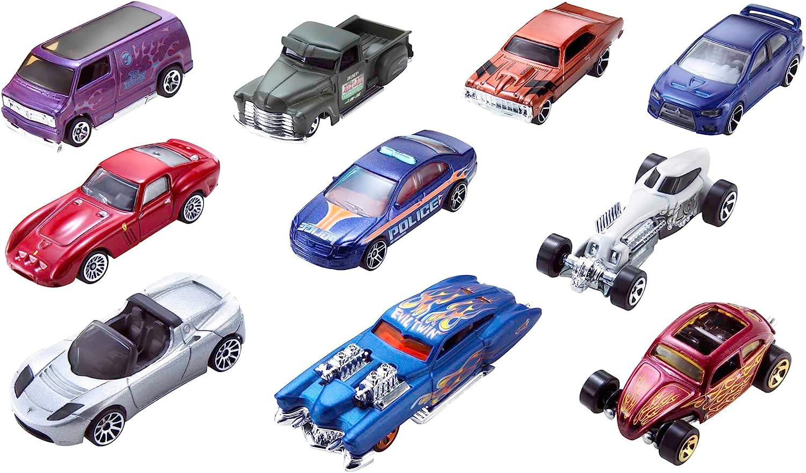
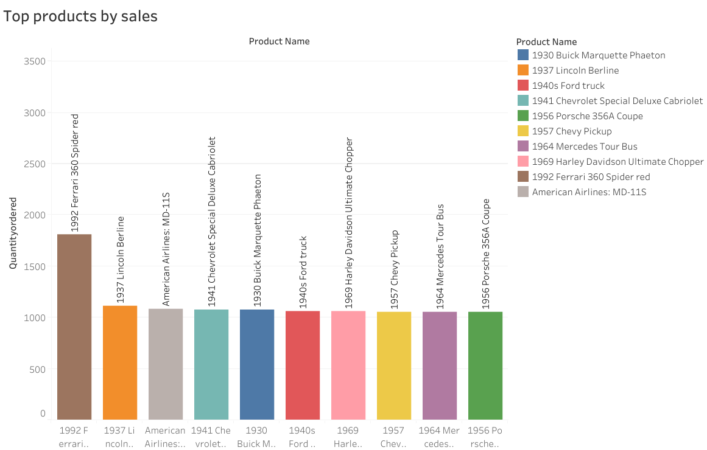
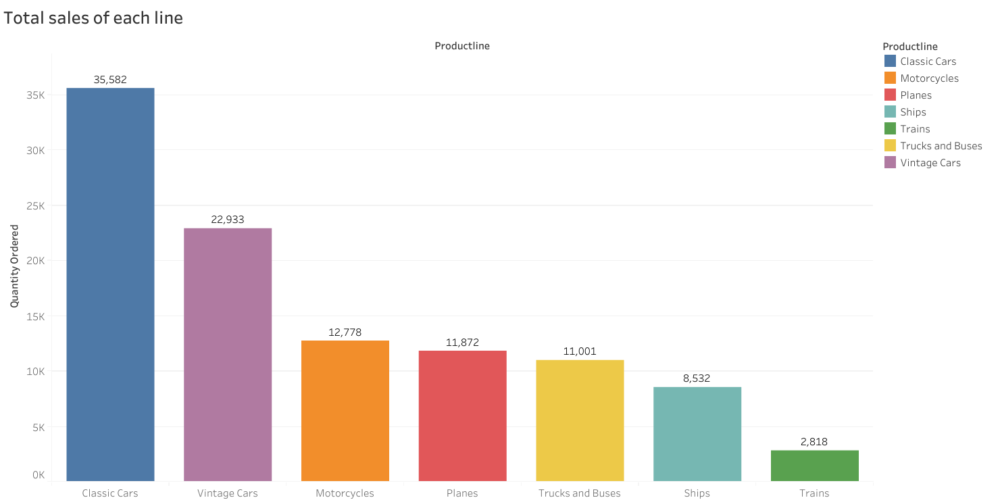
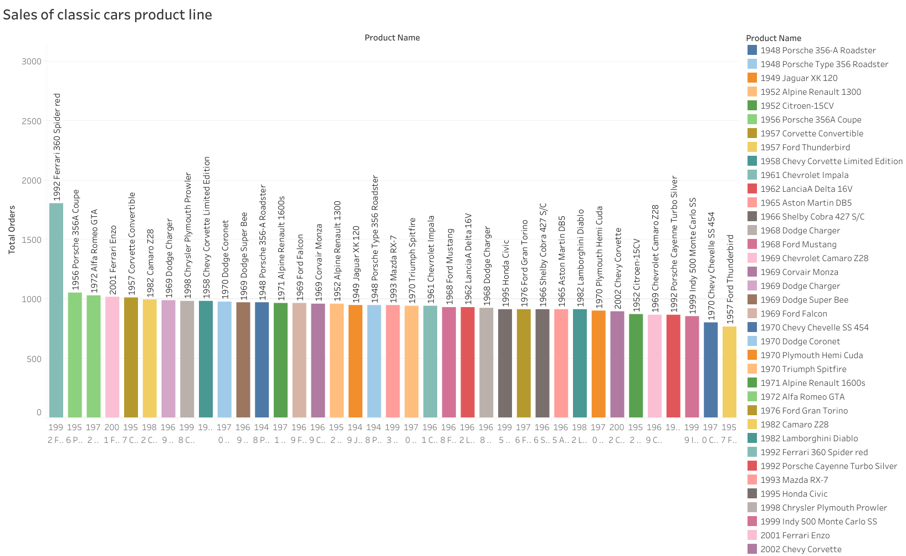
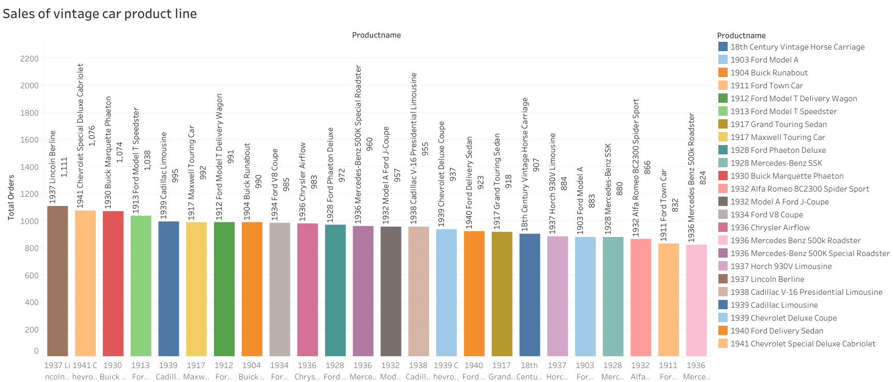
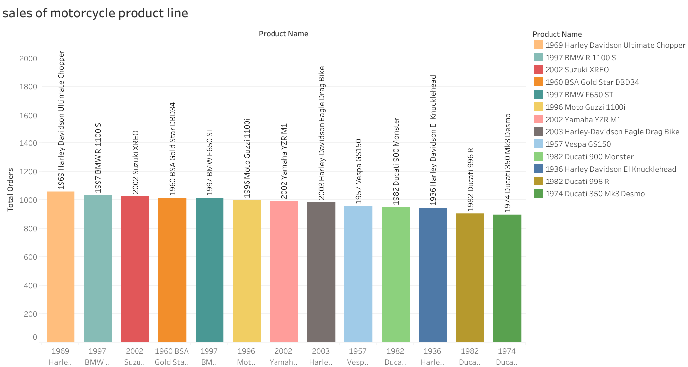
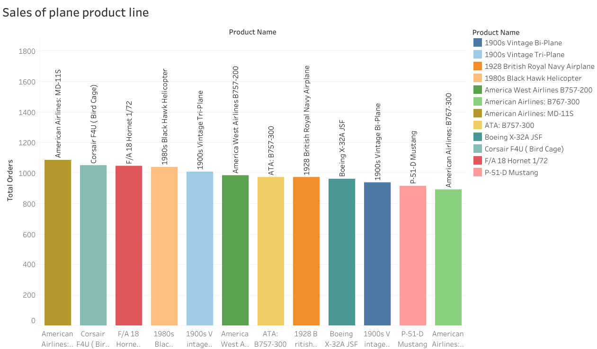
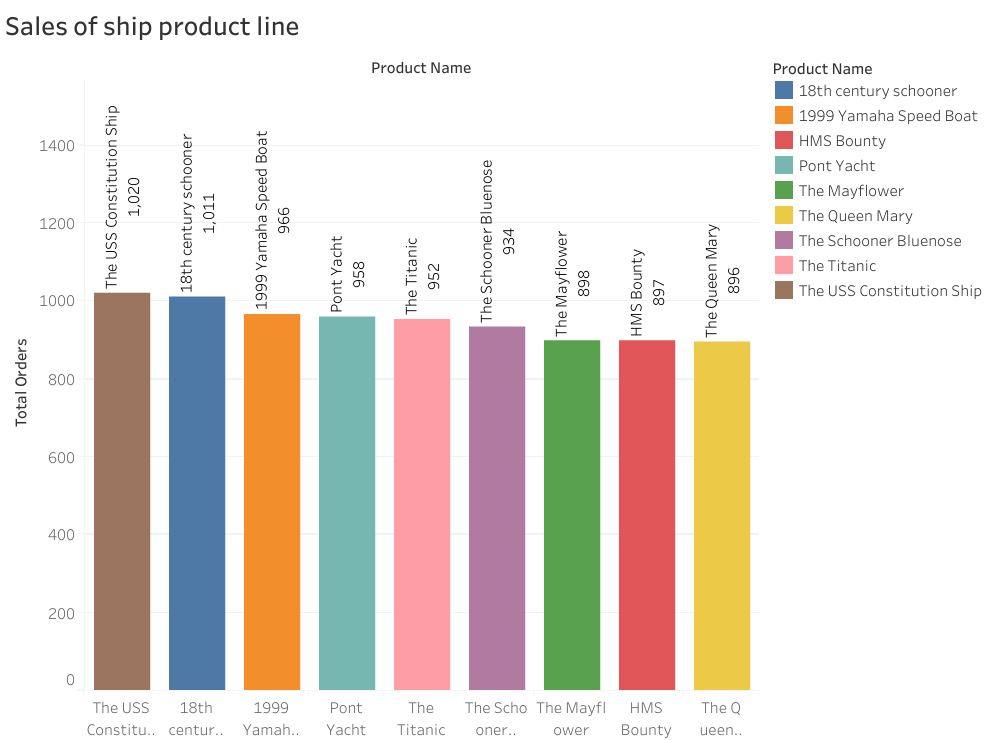
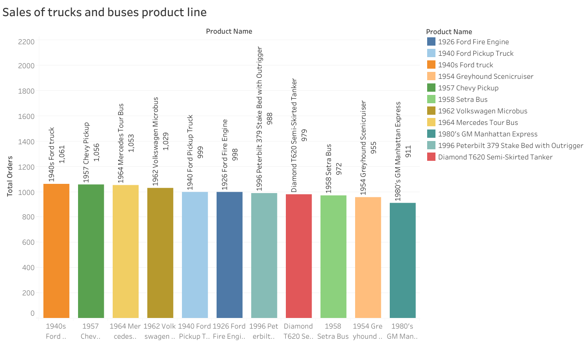

# Analysis of sales for model toy lines 

## Objective
The company Top Toy Models wants to review the sales of each of their product lines to determine which product line is most popular and which products to focus on in the coming year.

## Visualizations

This graph shows the top 10 products we sell, the 1992 ferrari 360 spider red is by far our most popular product.

In this chart of the total amount of products sold from each line classic cars are the clear most popular line we produce.

This is the sales of the classic car line.

This is the sales of the vintage car line

this is the sales of the motorcycle line

this is the sales of the planes line

this is the sales of the ships line

this is the sales of the trucks and buses line

## Analysis and Decisions

